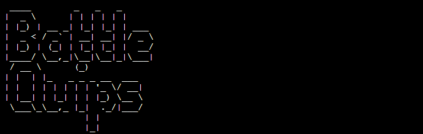

# BattleQuips

BattleQuips is a Python terminal game, which runs in the Code Institute mock terminal on Heroku.

Users will try to beat the computer by sinking all 5 ships, with each hit revealing a quote from a historical figure.

[Live project available here](https://battlequips.herokuapp.com/)

## How to play
BattleQuips is based on the classic pen-and-paper game. You can read about it here on [Wikipedia](https://en.wikipedia.org/wiki/Battleship_(game)).

In this version, the player will be asked if they want to play a game. The board will then be generated with random ship placements from a Google Sheets spreadsheet. They will then choose co-ordinates to attack, e.g. A2, B5 etc.

If their attack is succesful, the terminal will register a `Hit!`, and a war-related quote will be revealed. 

Hits are marked with an `X`, while misses are marked with an `O`. 

The user will have 15 attempts to sink all the computer's ships. The lives will reset after a `Hit!`.

The user wins when all the computer's ships are sunk. Otherwise, the computer wins! There is a scoreboard to track user and computer score.
  
# Features

## Existing Features
 
 - Random board generation
   - Ship placements retrieved from list of random co-ordinates on Google Sheets
   - The user cannot see where the computer's ship placements are
 - Play against the computer
 - Accepts user input
 - Retrieves and updates scoreboard from Google Sheets.
 - Validates user input
   - You cannot enter co-ordinates outside of the grid
   - You must enter a string in alphanumeric grid format
   - You cannot enter special characters
 - Utilized OOP 
 

## Future Features

- Allow the user to select difficulty 
  - Allow user to change number of attempts
  - Allow user to pick number and size of ships.

## Data Model

I used a Battlequips class as my model. The game creates an instance of the class when the user decides to start a game. This class holds the state of the board.

The Battlequips class stores grid size, number of ships, ship co-ordinates, board and number of user lives. The board stores the details of each co-ordinate - hit, miss or empty. 

The class also has methods to help play the game, such as `print_board` to print out the current state of the board, and `update_board` to update the state of the board after the user gives a valid co-ordinate.

The ship co-ordinates, scoreboard and quips are stored in a Google Sheet which are accessed via their API. The ship co-ordinates are retrieved when creating the Battlequips class. The scoreboard is retrieved and updated at the end of a game.

## Testing

I have manually tested my project by doing the following: 
- Passed the code through a PEP8 linter and confirmed there are no problems
- Given invalid inputs: special characters and off-grid attacks where A1-J0 alphanumeric grid is expected
- Tested in my local terminal and the Code Institute Heroku terminal
- Gave link to my personal QAs - AKA, my family :-)

# Bugs, problems

## Solved bugs

- When I was testing my project, I was testing for the user to try again after a loss, and when the board reprinted, the co-ordinate values of the previous game remained. I had to clear the board by reassigning the `board` of the Battlequips class instance to an empty nested array, thankfully solving my problem. 
- My validator method wasn't working as I initially intended - I used `isalpha` instead of `isalnum` when checking if the characters were alphanumeric. This was resulting in valid co-ordinates returning as invalid.

## Potential bugs, or hidden features...

- The user can input co-ordinates they have already established as a `Hit!`, and it will then register as a `Miss!`. This may be difficult for the user to keep track of what they have hit so far, but a miss makes sense logically as they have already hit the co-ordinate, thus losing a life. I may consider changing this in the future when creating feature to change difficulty. 

## Validator 
- PEP8
  - No errors returned from PEP8online.com

## Deployment

This project was deployed using Code Institute's mock terminal for Heroku.

- Steps for deployment:
  - Fork or clone this repository
  - Create a new Heroku app
  - Set the buildbacks to `Python` & `NodeJS` respectively
  - Link the Heroku app to the repository
  - Click on **Deploy**

## Acknowledgements

- Special thanks to my girlfriend Grace for support and guidance throughout the project
- Code Institute for the deployment terminal
- Wikipedia for the details of the Battleship game
- Online tutorials such as W3, Geekforgeek and Stack Overflow
- My family for being a superb QA team